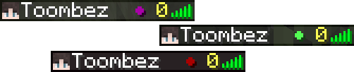

# Tabensions

Minecraft simple plugin for showing what dimension player in.

The plugin provides a **%tabensions_dimension%** placeholder to display which dimension the player is in.

> Plugin depends on the [PlaceholderAPI](https://github.com/PlaceholderAPI/PlaceholderAPI) plugin and requires it to be installed.

# Configuration

    

        config.yml
    

    <blockquote>
dimensionChar: "●"

colors:
&emsp;NORMAL: "&a"
&emsp;NETHER: "&4"
&emsp;THE_END: "&5"
&emsp;CUSTOM: "&7"

ignoredWorlds:
&emsp;- ExampleWorld
    </blockquote>

